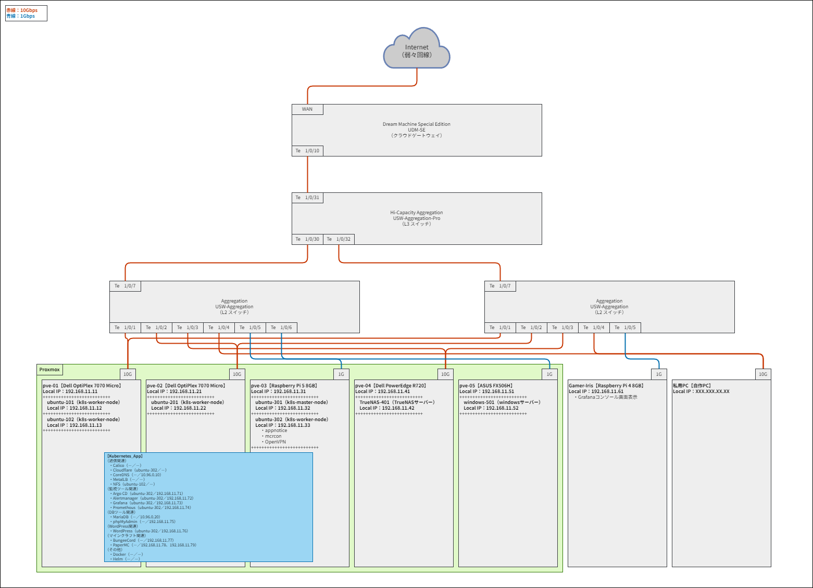

## **各操作マニュアル**

**【ネットワーク図】**<br>
<br>

<details>
<summary>【事前準備】<br></summary>

０１.[Discord ウェブフック](https://qiita.com/tmasuyama/items/9e37e89a9fd858e4df37)導入<br>

０２.[TereTerm](https://ja.osdn.net/projects/ttssh2/releases/)導入<br>

０３.[Cloudflare](https://www.cloudflare.com/ja-jp/)導入<br>

０４.[Tailscale](https://tailscale.com/)導入<br>

０５.Apps Script、スプレッドシート導入<br>

</details>

<details>
<summary>【Rasberry Pi設定】<br></summary>
<details>
<summary>∟【Node側設定】<br></summary>

０１.[Raspberry Pi Imager](https://www.raspberrypi.com/software/)より Raspberry Pi OS Lite をインストール（Windows 側操作）<br>

０２.[PXVIRT（Proxmox）](https://docs.pxvirt.lierfang.com/en/README.html)導入（Linux 側操作）<br>

```
sudo apt update && sudo apt upgrade -y
sudo apt install -y curl
nmcli connection show
nmcli connection show 'Wired connection 1'
sudo nmcli connection modify 'Wired connection 1' connection.id eth0
nmcli connection show eth0
sudo nmcli connection modify eth0 ipv4.addresses 任意のIPアドレス（★①）/24
sudo nmcli connection modify eth0 ipv4.gateway 192.168.11.1
sudo nmcli connection modify eth0 ipv4.dns 10.96.0.10,192.168.11.1
sudo nmcli connection modify eth0 ipv4.method manual
nmcli -f ipv4 connection show eth0
sudo reboot
ip a | grep ★①
以下を確認
+++++++++++++++++++++++++++++++++++++++++++++++++++++++++++++++++++++
inet ★①/24 brd 192.168.11.255 scope global noprefixroute eth0
+++++++++++++++++++++++++++++++++++++++++++++++++++++++++++++++++++++
sudo nano /etc/hosts
以下を設定
+++++++++++++++++++++++++++++++++++++++++++++++++++++++++++++++++++++
★① pve-XX
+++++++++++++++++++++++++++++++++++++++++++++++++++++++++++++++++++++
hostname --ip-address
以下を確認
+++++++++++++++++++++++++++++++++++++++++++++++++++++++++++++++++++++
★①
+++++++++++++++++++++++++++++++++++++++++++++++++++++++++++++++++++++
sudo passwd root
任意のパスワードを設定
sudo -s
curl -L https://mirrors.lierfang.com/pxcloud/lierfang.gpg -o /etc/apt/trusted.gpg.d/lierfang.gpg
source /etc/os-release
echo "deb [arch=arm64] https://mirrors.lierfang.com/pxcloud/pxvirt $VERSION_CODENAME main">/etc/apt/sources.list.d/pxvirt-sources.list
apt update && apt upgrade -y
apt install -y ifupdown2
apt install -y proxmox-ve postfix open-iscsi
「Local only」→「pve-XX」→「Enter」
reboot
「https://★①:8006」へ入る
以下はRaspberry Pi上のブート順序を変更する場合に実施
+++++++++++++++++++++++++++++++++++++++++++++++++++++++++++++++++++++
sudo rpi-eeprom-config --edit
BOOT_ORDER=0xf416（←SSDへのブート時）
BOOT_ORDER=0xf41（←microSDへのブート時）
sudo reboot
+++++++++++++++++++++++++++++++++++++++++++++++++++++++++++++++++++++
```

０３.初期設定（Windows_Proxmox 側操作）<br>

```
「データセンター」→「pve-XX」→「システム」→「ネットワーク」
「作成」→「Linux Bridge」
以下を設定
+++++++++++++++++++++++++++++++++++++++++++++++++++++++++++++++++++++
「名前」：vmbr0
「IPv4/CIDR」：★①/24
「ゲートウェイ(IPv4)」：192.168.11.1
「自動起動」：チェック
「ブリッジポート」：eth0
+++++++++++++++++++++++++++++++++++++++++++++++++++++++++++++++++++++
sudo reboot
sudo apt update && sudo apt upgrade -y
sudo raspi-config
「3 Interface Options」→「I1 SSH」→「YES」
「5 Localisation Options」→「L2 Timezone」→「Asia」→「Tokyo」
「5 Localisation Options」→「L3 Keyboard」→「Generic 105-key PC」→「Japanese」→「The default～」→「No compose key」
Finish
date
cd /etc/ssh
ls -l sshd_config
sudo nano sshd_config
以下を設定
+++++++++++++++++++++++++++++++++++++++++++++++++++++++++++++++++++++
PermitRootLogin prohibit-password
PasswordAuthentication no
+++++++++++++++++++++++++++++++++++++++++++++++++++++++++++++++++++++
sudo /etc/init.d/ssh restart
sudo systemctl stop dphys-swapfile
sudo systemctl disable dphys-swapfile
sudo wget https://github.com/mikefarah/yq/releases/latest/download/yq_linux_arm64 -O /usr/local/bin/yq
sudo chmod +x /usr/local/bin/yq
yq --version
```

０４.PC ケース設定（Windows_TereTerm 側操作）<br>

```
Argon系のPCケース使用時は手順書の設定を実施
sudo reboot
```

０５.ufw 導入（Windows_TereTerm 側操作）<br>

```
sudo apt install -y ufw
sudo ufw default deny
sudo ufw allow 22
sudo ufw allow 179
sudo ufw allow 2049
sudo ufw allow 3300
sudo ufw allow 6443
sudo ufw allow 6789
sudo ufw allow 8006
sudo ufw allow 9100
sudo ufw allow 10250
sudo ufw enable
sudo ufw status
```

０６.[Tailscale](https://tailscale.com/)導入（Windows_TereTerm 側操作）<br>

```
curl -fsSL https://tailscale.com/install.sh | sh
sudo tailscale up
表示されたリンクを押下
「Connect」
```

</details>

<details>
<summary>∟【VM側設定】<br></summary>

０１.VM 作成（Windows_Proxmox 側操作）<br>

</details>
</details>

<details>
<summary>【Rasberry Pi以外設定】<br></summary>
<details>
<summary>∟【Node側設定】<br></summary>

０１.[Proxmox](https://www.proxmox.com/en/downloads/category/iso-images-pve)導入（Linux 側操作）<br>

```
以下を設定
+++++++++++++++++++++++++++++++++++++++++++++++++++++++++++++++++++++
「Install Proxmox VE（Graphical）」を選択
「Country」：Japan
「Time zone」：Asia/Tokyo
「Keyboard Layout」：Japanese
「Password」：任意のパスワード
「Email」：任意のメールアドレス
「Management Interface」：複数nicある場合、管理IPにしたいnic
「Hostname (FQDN)」：pve-XX.local
「IP Address (CIDR)」：任意のIPアドレス（★②）/24
「Gateway」：192.168.11.1
「DNS Server」：10.96.0.10
+++++++++++++++++++++++++++++++++++++++++++++++++++++++++++++++++++++
useradd -m -s /bin/bash pve-XX
usermod -aG sudo pve-XX
passwd pve-XX
ノートPC時の場合は以下を設定
+++++++++++++++++++++++++++++++++++++++++++++++++++++++++++++++++++++
nano /etc/systemd/logind.conf
「HandleLidSwitch=ignore」へ編集
systemctl mask sleep.target suspend.target hibernate.target hybrid-sleep.target
systemctl restart systemd-logind
+++++++++++++++++++++++++++++++++++++++++++++++++++++++++++++++++++++
GPU使用時は以下を設定
+++++++++++++++++++++++++++++++++++++++++++++++++++++++++++++++++++++
nano /etc/default/grub
「GRUB_CMDLINE_LINUX_DEFAUTL」に「intel_iommu=on」を追加
+++++++++++++++++++++++++++++++++++++++++++++++++++++++++++++++++++++
「https://★②:8006」へ入る
```

０２.初期設定（Windows_Proxmox 側操作）<br>

```
「データセンター」→「pve-XX」→「システム」→「DNS」→「編集」→「DNS サーバ 2：192.168.11.1」→「OK」
「データセンター」→「pve-XX」→「アップデート」→「リポジトリ」→「～/debian/pve」→「disable」
「データセンター」→「pve-XX」→「アップデート」→「リポジトリ」→「～/debian/ceph-XXXXX」→「disable」
「データセンター」→「pve-XX」→「アップデート」→「リポジトリ」→「追加」→「No-Subscription」→「追加」
「データセンター」→「pve-XX」→「アップデート」→「リポジトリ」→「追加」→「Ceph XXXXX No-Subscription」→「追加」
reboot
apt update && apt upgrade -y
apt install -y libgl1 libegl1
apt install -y sudo
sudo apt update && sudo apt upgrade -y
sudo dpkg-reconfigure keyboard-configuration
以下を設定
+++++++++++++++++++++++++++++++++++++++++++++++++++++++++++++++++++++
「Generic 105-key PC (intl.) 」
「Japanese」
「Japanese」
「The default for the keyboard layout 」
「No compose key」
+++++++++++++++++++++++++++++++++++++++++++++++++++++++++++++++++++++
sudo timedatectl set-timezone Asia/Tokyo
timedatectl
date
cd /etc/ssh
ls -l sshd_config
sudo nano sshd_config
以下を設定
+++++++++++++++++++++++++++++++++++++++++++++++++++++++++++++++++++++
PermitRootLogin prohibit-password
PasswordAuthentication no
+++++++++++++++++++++++++++++++++++++++++++++++++++++++++++++++++++++
sudo /etc/init.d/ssh restart
sudo nano /etc/fstab
以下を設定
+++++++++++++++++++++++++++++++++++++++++++++++++++++++++++++++++++++
swap箇所をコメントアウト
+++++++++++++++++++++++++++++++++++++++++++++++++++++++++++++++++++++
ip a
ipアドレス（★③）を控える
sudo wget https://github.com/mikefarah/yq/releases/latest/download/yq_linux_amd64 -O /usr/local/bin/yq
sudo chmod +x /usr/local/bin/yq
yq --version
```

０３.IP アドレス固定（Windows_TereTerm 側操作）<br>

```
su -
cd /etc/network
ls -l interfaces
sudo nano interfaces
以下を設定
+++++++++++++++++++++++++++++++++++++++++++++++++++++++++++++++++++++
adress ★③/24
gateway 192.168.11.1
+++++++++++++++++++++++++++++++++++++++++++++++++++++++++++++++++++++
exit
```

０４.ufw 導入（Windows_TereTerm 側操作）<br>

```
sudo apt install -y ufw
sudo ufw default deny
sudo ufw allow 22
sudo ufw allow 179
sudo ufw allow 2049
sudo ufw allow 3300
sudo ufw allow 6443
sudo ufw allow 6789
sudo ufw allow 8006
sudo ufw allow 9100
sudo ufw allow 10250
sudo ufw enable
sudo ufw status
```

０５.[Tailscale](https://tailscale.com/)導入（Windows_TereTerm 側操作）<br>

```
curl -fsSL https://tailscale.com/install.sh | sh
sudo tailscale up
表示されたリンクを押下
「Connect」
```

０６.クラスタ作成（Windows_Proxmox（pve-01）側操作）<br>

```
「データセンター」→「クラスタ」→「クラスタを作成」
以下を設定
+++++++++++++++++++++++++++++++++++++++++++++++++++++++++++++++++++++
pve-cluster
+++++++++++++++++++++++++++++++++++++++++++++++++++++++++++++++++++++
「作成」
```

０７.クラスタ参加（Windows_Proxmox（pve-01 以外）側操作）<br>

```
「データセンター」→「クラスタ」→「クラスタに参加」→「join情報」を入力→「パスワード」を入力→「Join 'pve-cluster'」
```

０８.Ceph 導入（Windows_Proxmox 側操作）<br>

```
（pve-01で作業）
「データセンター」→「pve-01」→「Ceph」→「Cephをインストール」
以下を設定
+++++++++++++++++++++++++++++++++++++++++++++++++++++++++++++++++++++
「リポジトリ」：サブスクリプションがありません
「XXXXX（Cephのバージョン）のインストール開始」→「Y」→「次へ」
「Public Network IP/CIDR」：クラスタのマスタのIPアドレス
「Cluster Network IP/CIDR」：クラスタのマスタのIPアドレス
「次へ」→「完了」
+++++++++++++++++++++++++++++++++++++++++++++++++++++++++++++++++++++

（pve-XXで作業）
「データセンター」→「pve-XX」→「Ceph」→「Cephをインストール」
以下を設定
+++++++++++++++++++++++++++++++++++++++++++++++++++++++++++++++++++++
「リポジトリ」：サブスクリプションがありません
「XXXXX（Cephのバージョン）のインストール開始」→「Y」→「次へ」→「次へ」→「完了」
+++++++++++++++++++++++++++++++++++++++++++++++++++++++++++++++++++++

（pve-XX（ストレージを積んだpve）で作業）
「データセンター」→「pve-XX」→「Ceph」→「OSD」→「OSD作成」
以下を設定
+++++++++++++++++++++++++++++++++++++++++++++++++++++++++++++++++++++
「ディスク」：ストレージを選択
「作成」
+++++++++++++++++++++++++++++++++++++++++++++++++++++++++++++++++++++
「データセンター」→「pve-XX」→「Ceph」→「CephFS」→「メタデータサーバ」→「作成」→「作成」

（pve-01で作業）
「データセンター」→「pve-01」→「Ceph」→「CephFS」→「CephFSを作成」
以下を設定
+++++++++++++++++++++++++++++++++++++++++++++++++++++++++++++++++++++
「名前」：cephfs
「OK」
+++++++++++++++++++++++++++++++++++++++++++++++++++++++++++++++++++++
```

</details>

<details>
<summary>∟【VM側設定】<br></summary>

０１.VM 作成（Windows_Proxmox 側操作）<br>

０２.TrueNAS 設定（Windows_tailscale 側操作）<br>

```
「https://login.tailscale.com/admin/settings/keys」→「Generate auth key」
以下を設定
+++++++++++++++++++++++++++++++++++++++++++++++++++++++++++++++++++++
Description：TrueNAS-401
Reusable：ON
Ephemeral：OFF
+++++++++++++++++++++++++++++++++++++++++++++++++++++++++++++++++++++
「Generate key」
生成されたキー（★④）を控える
```

０３.TrueNAS 設定（Windows_Proxmox 側操作）<br>

```
RAIDコントローラーのH310・H710・H810シリーズを利用時、VM起動前に以下を実施
+++++++++++++++++++++++++++++++++++++++++++++++++++++++++++++++++++++
「https://fohdeesha.com/docs/perc.html」より「perc-crossflash-vX.X.zip」をダウンロード
上記「perc-crossflash-vX.X.zip」内の「deesh-FreeDOS-vX.X.iso」をbootデバイスとしてUSBに書き込む
上記リンク手順を実施
上記「perc-crossflash-vX.X.zip」内の「deesh-Linux-vX.X.iso」をbootデバイスとしてUSBに書き込む
上記リンク手順を実施
+++++++++++++++++++++++++++++++++++++++++++++++++++++++++++++++++++++
lspci | grep -i sas | grep SCSI
scsi（★⑤）を控える
sudo nano /etc/pve/qemu-server/401.conf
以下を設定
+++++++++++++++++++++++++++++++++++++++++++++++++++++++++++++++++++++
hostpci0: 0000:★⑤内容
+++++++++++++++++++++++++++++++++++++++++++++++++++++++++++++++++++++
「データセンター」→「pve-XX」→「VM」→「ハードウェア」→「追加」→「USBデバイス」→「USBポートを使用」→「バックアップ先のHDDを指定」→「追加」
VMを起動
以下を設定
+++++++++++++++++++++++++++++++++++++++++++++++++++++++++++++++++++++
「Enter」
「1」
「インストール先を選択（space）」
「Yes」
「1」
「パスワードを入力」
「No swap」
「OK」
「Reboot System」
+++++++++++++++++++++++++++++++++++++++++++++++++++++++++++++++++++++
以下を設定
+++++++++++++++++++++++++++++++++++++++++++++++++++++++++++++++++++++
「Enter an option from 1-11」：1
「Enter」
「ipv4_dhcp」：No
「aliases」：192.168.11.XX/24
「Save」
「Select an interface (q to quit)」：a
「Select an interface (q to quit)」：p
「Select an interface (q to quit)」：q
「Enter an option from 1-11」：2
「ipv4gateway」：192.168.11.1
「namesarver1」：10.96.0.10
「namesarver2」：192.168.11.1
「Save」
+++++++++++++++++++++++++++++++++++++++++++++++++++++++++++++++++++++
下記へアクセス
+++++++++++++++++++++++++++++++++++++++++++++++++++++++++++++++++++++
http://192.168.11.XX:8006
（ユーザー名：truenas_admin、PW：設定したパスワード）
+++++++++++++++++++++++++++++++++++++++++++++++++++++++++++++++++++++
「System Settings」→「General」→「Localization」→「Settings」→「Language」→「Japanese (ja)」
「Console Keyboard Map」→「Japanese (jp)」
「Timezone」→「Asia/Tokyo」
「SAVE」
「認証情報」→「ユーザー」→「ADD」
以下を設定
+++++++++++++++++++++++++++++++++++++++++++++++++++++++++++++++++++++
「ユーザー名」：任意の名前
「SMBアクセス」：チェック
「TrueNASアクセス」：Full Admin
「シェルアクセス」：チェック
「パスワード」：任意のパスワード
「保存」
+++++++++++++++++++++++++++++++++++++++++++++++++++++++++++++++++++++
「ストレージ」→「プールの作成」
以下を設定
+++++++++++++++++++++++++++++++++++++++++++++++++++++++++++++++++++++
「tank」
「暗号化チェック」
「確認チェック」→「I Understand」
「Next」
「Layout」：任意のレイド
「Disk Size」：HDDの容量
「Width」：搭載しているHDD数
「Number of VDEVs」：1
「Save And Go To Review」
「プールの作成」
「確認チェック」→「続ける」
「Download Encryption Key」→「Done」
+++++++++++++++++++++++++++++++++++++++++++++++++++++++++++++++++++++
「Datesets」→「データセット」を追加
以下を設定
+++++++++++++++++++++++++++++++++++++++++++++++++++++++++++++++++++++
「Name」：share-01
「Share Type」：SMB
保存
+++++++++++++++++++++++++++++++++++++++++++++++++++++++++++++++++++++
「Shares」→「Windows (SMB)Shares」→「ADD」
以下を設定
+++++++++++++++++++++++++++++++++++++++++++++++++++++++++++++++++++++
「Path」：/mnt/tank/share-01/06-bk/Minecraft
「名前」：Minecraft
「Enable～にチェック」
「保存」
「Restart Service」
+++++++++++++++++++++++++++++++++++++++++++++++++++++++++++++++++++++
「Shares」→「Windows (SMB)Shares」→「ADD」
以下を設定
+++++++++++++++++++++++++++++++++++++++++++++++++++++++++++++++++++++
「Path」：/mnt/tank/share-01/03-music
「名前」：music
「Enable～にチェック」
「保存」
「Restart Service」
+++++++++++++++++++++++++++++++++++++++++++++++++++++++++++++++++++++
「Shares」→「Windows (SMB)Shares」→「ADD」
以下を設定
+++++++++++++++++++++++++++++++++++++++++++++++++++++++++++++++++++++
「Path」：/mnt/tank/share-01/06-bk/MX-Linux
「名前」：MX-Linux
「Enable～にチェック」
「保存」
「Restart Service」
+++++++++++++++++++++++++++++++++++++++++++++++++++++++++++++++++++++
「Shares」→「Windows (SMB)Shares」→「ADD」
以下を設定
+++++++++++++++++++++++++++++++++++++++++++++++++++++++++++++++++++++
「Path」：/mnt/tank/share-01/06-bk/Proxmox
「名前」：Proxmox
「Enable～にチェック」
「保存」
「Restart Service」
+++++++++++++++++++++++++++++++++++++++++++++++++++++++++++++++++++++
「ストレージ」→「プールの作成」
以下を設定
+++++++++++++++++++++++++++++++++++++++++++++++++++++++++++++++++++++
「tank-bk」
「暗号化チェック」
「確認チェック」→「I Understand」
「Next」
「Layout」：任意のレイド
「Disk Size」：HDDの容量
「Width」：搭載しているHDD数
「Number of VDEVs」：1
「Save And Go To Review」
「プールの作成」
「確認チェック」→「続ける」
「Download Encryption Key」→「Done」
+++++++++++++++++++++++++++++++++++++++++++++++++++++++++++++++++++++
「Datesets」→「データセット」を追加
以下を設定
+++++++++++++++++++++++++++++++++++++++++++++++++++++++++++++++++++++
「Name」：share-02
「Share Type」：SMB
保存
「Date Protection」→「Periodic Snapshot タスク」→「Add」
以下を設定
+++++++++++++++++++++++++++++++++++++++++++++++++++++++++++++++++++++
「データセット」：tank/share-01
「Snapshot Lifetime」：1
「Unit」：Week
「空のスナップショットの取得を許可する」：チェック外す
「保存」
+++++++++++++++++++++++++++++++++++++++++++++++++++++++++++++++++++++
「システム」→「詳細設定」→「Cron Jobs」→「ADD」
以下を設定
+++++++++++++++++++++++++++++++++++++++++++++++++++++++++++++++++++++
「説明」：S.M.A.R.T. Test
「コマンド」：midclt call disk.smart_test SHORT "$(printf '[%s]' "$(printf '"sd%c",' {a..i} | sed 's/,$//')")" || true; smartctl -d sat -t short /dev/sdj || true
「Run As User」：root
「スケジュール」：0 0 * * *
「標準出力を非表示にする」：チェック
「標準エラーを非表示にする」：チェック外す
「保存」
+++++++++++++++++++++++++++++++++++++++++++++++++++++++++++++++++++++
「システム」→「詳細設定」→「Cron Jobs」→「ADD」
以下を設定
+++++++++++++++++++++++++++++++++++++++++++++++++++++++++++++++++++++
「説明」：backup
「コマンド」：if mount | grep -q "/mnt/tank-bk"; then /usr/bin/rsync -avh --delete --no-perms --no-owner --no-group --no-specials --no-devices /mnt/tank/share-01/ /mnt/tank-bk/share-02/; else echo "$(date): Backup skipped – tank-bk not mounted" > /var/log/rsync-backup.log; fi
「Run As User」：root
「スケジュール」：0 4 * * wed
「標準出力を非表示にする」：チェック外す
「標準エラーを非表示にする」：チェック外す
「保存」
+++++++++++++++++++++++++++++++++++++++++++++++++++++++++++++++++++++
「System Settings」→「全般」→「Email」→「設定」→「GmailOAuthにチェック」
  →「Log In to Gmail Again」→「Proceed」→「保存」
「System Settings」→「アラート設定」→「Emailの右端点々を押下」→「編集」
以下を設定
+++++++++++++++++++++++++++++++++++++++++++++++++++++++++++++++++++++
「名前」：E-mail
「Enableにチェック」
「Type」：E-mail
「Lavel」：警告
「E-mail」：自分のメールアドレス
「保存」
+++++++++++++++++++++++++++++++++++++++++++++++++++++++++++++++++++++
「Apps」→「Discover Apps」→「Configuration」→「Choose pool」→「tank」→「選択」
「Apps」→「Discover Apps」→「tailscale」→「インストール」
以下を設定
+++++++++++++++++++++++++++++++++++++++++++++++++++++++++++++++++++++
ホスト名：truenas-401
Auth Key：★④内容
+++++++++++++++++++++++++++++++++++++++++++++++++++++++++++++++++++++
「インストール」
```

</details>
</details>

<details>
<summary>【共通設定】<br></summary>

０１.初期設定（Windows_Proxmox（Node、VM）側操作）<br>

```
sudo apt update && sudo apt upgrade -y
sudo dpkg-reconfigure keyboard-configuration
以下を設定
+++++++++++++++++++++++++++++++++++++++++++++++++++++++++++++++++++++
「Generic 105-key PC (intl.) 」
「Japanese」
「Japanese」
「The default for the keyboard layout 」
「No compose key」
+++++++++++++++++++++++++++++++++++++++++++++++++++++++++++++++++++++
sudo timedatectl set-timezone Asia/Tokyo
timedatectl
date
cd /etc/ssh
ls -l sshd_config
sudo nano sshd_config
以下を設定
+++++++++++++++++++++++++++++++++++++++++++++++++++++++++++++++++++++
PermitRootLogin no
+++++++++++++++++++++++++++++++++++++++++++++++++++++++++++++++++++++
sudo /etc/init.d/ssh restart
sudo nano /etc/fstab
以下を設定
+++++++++++++++++++++++++++++++++++++++++++++++++++++++++++++++++++++
swap箇所をコメントアウト
+++++++++++++++++++++++++++++++++++++++++++++++++++++++++++++++++++++
ip a
仮想NIC（★⑥）を控える
ipアドレス（★⑦）を控える
sudo wget https://github.com/mikefarah/yq/releases/latest/download/yq_linux_amd64 -O /usr/local/bin/yq
sudo wget https://github.com/mikefarah/yq/releases/latest/download/yq_linux_arm64 -O /usr/local/bin/yq
sudo chmod +x /usr/local/bin/yq
yq --version
以下を設定
+++++++++++++++++++++++++++++++++++++++++++++++++++++++++++++++++++++
「データセンター」→「ストレージ」→「追加」→「SMB/CIFS」
「ID」：Proxmox
「サーバ」：192.168.11.XX
「ユーザー名」：設定したユーザー名
「パスワード」：設定したパスワード
「Share」：Proxmox
「有効」：チェック
「内容」：VZDump バックアップ
「バックアップRetention」
「すべてのバックアップを保持」のチェックを外す
+++++++++++++++++++++++++++++++++++++++++++++++++++++++++++++++++++++
```

０２.[SSH](https://webkaru.net/linux/tera-term-ssh-login-public-key/)接続（Windows_TereTerm（Node、VM）側操作）<br>

```
cd
秘密鍵・公開鍵（ED25519鍵）の導入
cd .ssh
chmod 600 *
「appnotice」導入サーバー側の公開鍵に全Node、全VM側内容を追加
Teretermのショートカットのリンク先に以下を設定
+++++++++++++++++++++++++++++++++++++++++++++++++++++++++++++++++++++
ttermpro.exeの絶対パス ★⑦:22 /auth=publickey /user="ユーザー名" /keyfile="ED25519鍵の絶対パス"
+++++++++++++++++++++++++++++++++++++++++++++++++++++++++++++++++++++
```

０３.IP アドレス固定（Windows_TereTerm（VM）側操作）<br>

```
cd /etc/netplan
ls -l 50-cloud-init.yaml
sudo cp -p 50-cloud-init.yaml 99-cloud-init.yaml
sudo nano 99-cloud-init.yaml
以下を設定
+++++++++++++++++++++++++++++++++++++++++++++++++++++++++++++++++++++
network:
    version: 2
    ethernets:
        ★⑥内容:
            dhcp4: no
            addresses: [★⑦内容/24]
            routes:
              - to: default
                via: 192.168.11.1
            nameservers:
                addresses: [192.168.11.1]
                search: []
+++++++++++++++++++++++++++++++++++++++++++++++++++++++++++++++++++++
sudo netplan apply
ip a
sudo reboot
```

０４.ufw 導入（Windows_TereTerm（VM）側操作）<br>

```
sudo apt update && sudo apt upgrade -y
sudo apt install -y ufw
sudo ufw default deny
sudo ufw allow 22
sudo ufw allow 179
sudo ufw allow 2049
sudo ufw allow 3300
sudo ufw allow 6443
sudo ufw allow 6789
sudo ufw allow 8006
sudo ufw allow 9100
sudo ufw allow 10250
sudo ufw enable
sudo ufw status
```

０５.GitHub 設定（Windows_TereTerm（Node、VM）側操作）<br>

```
sudo apt install -y git
git config --global user.name "自分の名前"
git config --global user.email 自分のアドレス
git config --list
cd .ssh
sudo ssh-keygen -t rsa
以下を入力
+++++++++++++++++++++++++++++++++++++++++++++++++++++++++++++++++++++
id_git_rsa
Enter
Enter
+++++++++++++++++++++++++++++++++++++++++++++++++++++++++++++++++++++
sudo cat id_git_rsa.pub
GitHub（https://github.com/settings/keys）へ登録
作成したGitHubの秘密鍵を各サーバーの「ホームディレクトリ/.ssh」配下へ配置
「appnotice」導入サーバー側の秘密鍵を各サーバー側の「ホームディレクトリ/.ssh」配下へ配置
sudo touch config
sudo nano config
以下を設定
+++++++++++++++++++++++++++++++++++++++++++++++++++++++++++++++++++++
Host github
User git
Hostname github.com
Port 22
IdentityFile ~/.ssh/id_git_rsa
+++++++++++++++++++++++++++++++++++++++++++++++++++++++++++++++++++++
sudo chmod 600 *
sudo chown $USER:$USER *
eval `ssh-agent`
ssh-add ~/.ssh/id_git_rsa
ssh -T git@github.com
以下が表示されていることを確認
+++++++++++++++++++++++++++++++++++++++++++++++++++++++++++++++++++++
Hi GitHubのユーザー名! You've successfully authenticated, but GitHub does not provide shell access.
+++++++++++++++++++++++++++++++++++++++++++++++++++++++++++++++++++++
cd
git clone git@github.com:Gamer-Iris/Linux.git
sudo grep -rl "ご自分の環境に合わせてください。"
"ご自分の環境に合わせてください。"の文言資材を適宜修正
sudo chmod 775 ~/Linux/platforms/scripts/*

【GitHub_Webhooks設定】
「Settings」→「Webhooks」→「Add webhook」
以下を設定後、「Add webhook」
+++++++++++++++++++++++++++++++++++++++++++++++++++++++++++++++++++++
「Payload URL *」：Discord Webhook URL/github
「Content type *」：application/json
「Which events would you like to trigger this webhook?」：Let me select individual events.
以下をチェック
「Branch or tag creation」
「Branch or tag deletion」
「Pull requests」
+++++++++++++++++++++++++++++++++++++++++++++++++++++++++++++++++++++

【GitHub_Actions設定】
「Settings」→「Actions」→「General」→「Workflow permissions」
「Read and write permissions」選択後、「Save」
「Settings」→「Secrets and variables」→「Actions」→「Secrets」→「Repository secrets」
「New repository secrets」
以下を設定後、「Add secret」
+++++++++++++++++++++++++++++++++++++++++++++++++++++++++++++++++++++
「DEPLOY_KEY_PLUGIN」：ubuntu-302側の秘密鍵
「DEPLOY_KEY_RCON」：ubuntu-302側の秘密鍵
「PLUGIN_DEPLOY_TARGET」：ubuntu-302側のIPアドレス
「RCON_EXEC_TARGET」：ubuntu-302側のIPアドレス
「PLUGIN_DEPLOY_USER」：ubuntu-302側のユーザー名
「RCON_EXEC_USER」：ubuntu-302側のユーザー名
+++++++++++++++++++++++++++++++++++++++++++++++++++++++++++++++++++++
「Settings」→「Actions」→「Runners」
「New self-hosted runner」
以下を確認
+++++++++++++++++++++++++++++++++++++++++++++++++++++++++++++++++++++
「Runner image」：Linux
「Configure」：./config.cmd --url https://github.com/Gamer-Iris/Linux --token ★⑧
+++++++++++++++++++++++++++++++++++++++++++++++++++++++++++++++++++++
ubuntu-302にて以下を実施
+++++++++++++++++++++++++++++++++++++++++++++++++++++++++++++++++++++
mkdir -p ~/actions-runner && cd ~/actions-runner
LATEST_VERSION=$(curl -s https://api.github.com/repos/actions/runner/releases/latest | grep tag_name | cut -d '"' -f4)
curl -LO https://github.com/actions/runner/releases/download/${LATEST_VERSION}/actions-runner-linux-$(uname -m | sed 's/x86_64/x64/;s/aarch64/arm64/')-${LATEST_VERSION:1}.tar.gz
tar xzf actions-runner-linux-*.tar.gz

（ubuntu-302で作業）
./config.sh \
  --name plugin-runner \
  --url https://github.com/Gamer-Iris/Linux \
  --token ★⑧ \
  --labels self-hosted,plugin-runner
Enter
Enter
sudo ./svc.sh install
sudo ./svc.sh start
rm .credentials .runner
./config.sh \
  --name rcon-runner \
  --url https://github.com/Gamer-Iris/Linux \
  --token ★⑧ \
  --labels self-hosted,rcon-runner
Enter
Enter
sudo ./svc.sh install
sudo ./svc.sh start
+++++++++++++++++++++++++++++++++++++++++++++++++++++++++++++++++++++
GitHub のリポジトリ画面に戻る
「Actions」→「Build and Release」→「Run workflow」
「Run workflow」
```

０６.docker 導入（Windows_TereTerm（VM（k8s 環境全て））側操作）<br>

```
sudo apt install -y docker.io
docker --version
sudo systemctl enable docker
sudo systemctl start docker
sudo systemctl status docker
```

０７.[Kubernetes](https://kubernetes.io/docs/setup/production-environment/tools/kubeadm/install-kubeadm/#installing-kubeadm-kubelet-and-kubectl)導入（Windows_TereTerm（VM（k8s 環境全て））側操作）<br>

```
sudo ln -s /etc/apparmor.d/runc /etc/apparmor.d/disable/
sudo apparmor_parser -R /etc/apparmor.d/runc
sudo apt install -y apt-transport-https ca-certificates curl gpg
LATEST_VERSION=$(curl -s https://api.github.com/repos/kubernetes/kubernetes/releases/latest | grep tag_name | cut -d '"' -f 4 | sed 's/v//g' | cut -d '.' -f 1,2)
curl -fsSL https://pkgs.k8s.io/core:/stable:/v${LATEST_VERSION}/deb/Release.key | sudo gpg --dearmor -o /etc/apt/keyrings/kubernetes-apt-keyring.gpg
echo "deb [signed-by=/etc/apt/keyrings/kubernetes-apt-keyring.gpg] https://pkgs.k8s.io/core:/stable:/v${LATEST_VERSION}/deb/ /" | sudo tee /etc/apt/sources.list.d/kubernetes.list
sudo apt update && sudo apt upgrade -y
sudo apt install -y kubeadm kubelet kubectl
sudo apt-mark hold kubeadm kubelet kubectl
kubeadm version
sudo nano /etc/default/grub
以下を設定
+++++++++++++++++++++++++++++++++++++++++++++++++++++++++++++++++++++
GRUB_CMDLINE_LINUX="systemd.unified_cgroup_hierarchy=1"
+++++++++++++++++++++++++++++++++++++++++++++++++++++++++++++++++++++
sudo update-grub
sudo reboot
```

０８.containerd 導入（Windows_TereTerm（VM（ubuntu-301））側操作）<br>

```
cd
LATEST_VERSION=$(curl -s https://api.github.com/repos/containerd/containerd/releases/latest | grep tag_name | cut -d '"' -f 4)
LATEST_VERSION_WITHOUT_V=${LATEST_VERSION#v}
wget https://github.com/containerd/containerd/releases/download/${LATEST_VERSION}/containerd-${LATEST_VERSION_WITHOUT_V}-linux-arm64.tar.gz
sudo tar zxvf containerd-${LATEST_VERSION_WITHOUT_V}-linux-arm64.tar.gz -C /usr/local/
sudo wget https://raw.githubusercontent.com/containerd/containerd/main/containerd.service \
  -O /etc/systemd/system/containerd.service
sudo systemctl daemon-reload
sudo systemctl start containerd
sudo systemctl enable containerd
sudo mkdir -p /etc/containerd
sudo touch /etc/containerd/config.toml
sudo containerd config default | sudo tee /etc/containerd/config.toml
sudo nano /etc/containerd/config.toml
以下を設定
+++++++++++++++++++++++++++++++++++++++++++++++++++++++++++++++++++++
[plugins."io.containerd.grpc.v1.cri".containerd.runtimes.runc]
  ...
  [plugins."io.containerd.grpc.v1.cri".containerd.runtimes.runc.options]
    SystemdCgroup = true #デフォルトはfalse
+++++++++++++++++++++++++++++++++++++++++++++++++++++++++++++++++++++
sudo rm -r containerd-*-linux-arm64.tar.gz
```

０９.runc 導入（Windows_TereTerm（VM（ubuntu-301））側操作）<br>

```
cd
LATEST_VERSION=$(curl -s https://api.github.com/repos/opencontainers/runc/releases/latest | grep tag_name | cut -d '"' -f 4)
wget https://github.com/opencontainers/runc/releases/download/${LATEST_VERSION}/runc.arm64
sudo install -m 755 runc.arm64 /usr/local/sbin/runc
cd
LATEST_VERSION=$(curl -s https://api.github.com/repos/containernetworking/plugins/releases/latest | grep tag_name | cut -d '"' -f 4)
wget https://github.com/containernetworking/plugins/releases/download/${LATEST_VERSION}/cni-plugins-linux-arm64-${LATEST_VERSION}.tgz
sudo mkdir -p /opt/cni/bin
sudo tar Cxzvf /opt/cni/bin cni-plugins-linux-arm64-${LATEST_VERSION}.tgz
sudo rm -r runc.arm64 cni-plugins-linux-arm64-*.tgz
```

１０.kubeadm init 設定（Windows_TereTerm（VM（ubuntu-301））側操作）<br>

```
sudo systemctl restart kubelet
sudo systemctl restart containerd
sudo kubeadm init \
  --pod-network-cidr=192.168.0.0/16 \
  --cri-socket=unix:///run/containerd/containerd.sock \
  --ignore-preflight-errors=Mem
以下を確認
+++++++++++++++++++++++++++++++++++++++++++++++++++++++++++++++++++++
Your Kubernetes control-plane has initialized successfully!

To start using your cluster, you need to run the following as a regular user:

  ★⑨コマンド

Alternatively, if you are the root user, you can run:

  export KUBECONFIG=/etc/kubernetes/admin.conf

You should now deploy a pod network to the cluster.
Run "kubectl apply -f [podnetwork].yaml" with one of the options listed at:
  https://kubernetes.io/docs/concepts/cluster-administration/addons/

Then you can join any number of worker nodes by running the following on each as root:

★⑩コマンド
+++++++++++++++++++++++++++++++++++++++++++++++++++++++++++++++++++++
★⑨コマンド
```

１１.[calico](https://docs.tigera.io/calico/latest/getting-started/kubernetes/quickstart)導入（Windows_TereTerm（VM（ubuntu-301））側操作）<br>

```
cd
LATEST_VERSION=$(curl -s https://api.github.com/repos/projectcalico/calico/releases/latest | grep tag_name | cut -d '"' -f 4)
kubectl create -f https://raw.githubusercontent.com/projectcalico/calico/${LATEST_VERSION}/manifests/tigera-operator.yaml
kubectl create -f https://raw.githubusercontent.com/projectcalico/calico/${LATEST_VERSION}/manifests/custom-resources.yaml
kubectl get pod,svc --all-namespaces -o wide
```

１２.Worker Node 側設定（Windows_TereTerm（VM（ubuntu-301 以外））側操作）<br>

```
Master Nodeの.kubeをWorker Nodeへ配置
sudo chown $(id -u):$(id -g) $HOME/.kube/config
sudo -s
★⑩コマンド
exit
kubectl get nodes -o wide
kubectl -n kube-system get pod -o wide
```

１３.各ノードへのラベル付与（Windows_TereTerm（VM（k8s 環境いずれか））側操作）<br>

```
kubectl get nodes --show-labels
kubectl label nodes ubuntu-101 labelname=ubuntu-101
kubectl label nodes ubuntu-201 labelname=ubuntu-201
kubectl label nodes ubuntu-301 labelname=ubuntu-301
kubectl label nodes ubuntu-302 labelname=ubuntu-302
kubectl get nodes --show-labels
```

１４.[Helm](https://github.com/helm/helm/releases)導入（Windows_TereTerm（VM（k8s 環境全て））側操作）<br>

```
cd ~/Linux/platforms/kubernetes
LATEST_VERSION=$(curl -s https://api.github.com/repos/helm/helm/releases/latest | grep tag_name | cut -d '"' -f 4 | sed 's/v//g')
wget https://get.helm.sh/helm-v${LATEST_VERSION}-linux-amd64.tar.gz
wget https://get.helm.sh/helm-v${LATEST_VERSION}-linux-arm64.tar.gz
tar xvf helm*.tar.gz
sudo mv linux-*/helm /usr/local/bin/
sudo chown -R $USER:$USER ~/.kube/config
sudo chmod 600 ~/.kube/config
helm version --short
sudo rm -r helm*.tar.gz
```

１５.cifs-utils 導入（Windows_TereTerm（VM（k8s 環境全て））側操作）<br>

```
sudo apt update && sudo apt upgrade -y
sudo apt install -y cifs-utils
which mount.cifs
以下を確認
+++++++++++++++++++++++++++++++++++++++++++++++++++++++++++++++++++++
/usr/sbin/mount.cifs
+++++++++++++++++++++++++++++++++++++++++++++++++++++++++++++++++++++
```

１６.[csi-driver-smb](https://github.com/kubernetes-csi/csi-driver-smb)導入（Windows_TereTerm（VM（k8s 環境いずれか））側操作）<br>

```
helm repo add csi-driver-smb https://raw.githubusercontent.com/kubernetes-csi/csi-driver-smb/master/charts
helm repo update
helm upgrade --install csi-driver-smb csi-driver-smb/csi-driver-smb -n kube-system
kubectl get csidriver | grep smb
kubectl -n kube-system get pods -l app=csi-smb-controller
kubectl -n kube-system get pods -l app=csi-smb-node
```

１７.metallb 導入（Windows_TereTerm（VM（k8s 環境いずれか））側操作）<br>

```
helm repo add metallb https://metallb.github.io/metallb
helm repo update
helm search repo metallb
kubectl create namespace metallb-system
helm install metallb metallb/metallb -n metallb-system
kubectl apply -f ~/Linux/platforms/kubernetes/apps/metallb/metallb-config.yml
kubectl get pods -n metallb-system -o wide
```

１８.CoreDNS 設定（Windows_TereTerm（VM（k8s 環境いずれか））側操作）<br>

```
kubectl apply -f ~/Linux/platforms/kubernetes/apps/coredns/coredns-configmap.yml
kubectl delete pod -n kube-system -l k8s-app=kube-dns
sudo reboot
kubectl get pods -n kube-system -o wide
```

１９.[mcrcon](https://github.com/Tiiffi/mcrcon)設定（Windows_TereTerm（VM（ubuntu-302））側操作）<br>

```
cd
sudo apt install -y gcc make
git clone https://github.com/Tiiffi/mcrcon.git
cd mcrcon
make
sudo make install
mcrcon -v
以下を確認
+++++++++++++++++++++++++++++++++++++++++++++++++++++++++++++++++++++
mcrcon バージョン番号
+++++++++++++++++++++++++++++++++++++++++++++++++++++++++++++++++++++
rm -fr ~/mcrcon
```

２０.[Argo CD](https://argo-cd.readthedocs.io/en/stable/)導入（Windows_TereTerm（VM（ubuntu-302））側操作）<br>

```
【Argo CD導入】
cd
helm repo add argo https://argoproj.github.io/argo-helm
helm repo update
helm search repo argo/argo-cd
kubectl create namespace argocd
helm install argocd argo/argo-cd -n argocd -f ~/Linux/platforms/kubernetes/argo-cd-custom.yml
kubectl get secret argocd-initial-admin-secret -n argocd -o jsonpath="{.data.password}" | base64 --decode
以下を確認
+++++++++++++++++++++++++++++++++++++++++++++++++++++++++++++++++++++
★⑪
+++++++++++++++++++++++++++++++++++++++++++++++++++++++++++++++++++++
LATEST_VERSION=$(curl --silent "https://api.github.com/repos/argoproj/argo-cd/releases/latest" | grep -Po '"tag_name": "\K.*?(?=")')
curl -sSL -o argocd https://github.com/argoproj/argo-cd/releases/download/${LATEST_VERSION}/argocd-linux-arm64
chmod +x argocd
sudo mv argocd /usr/local/bin/
kubectl get svc -n argocd -o wide
argocd表示内容にてログイン
  ※argocdはユーザー名：admin、パスワード：★⑪
「User Info」→「UPDATE PASSWORD」
任意のパスワードを設定

【Argo CD設定】
ssh-keygen -t ed25519 -f ./argo
Enter
Enter
GithubのSettingsへ登録
「右上のアイコン」→「Settings」→「SSH and GPG keys」→「New SSH key」
以下を設定後、「Add SSH key」
+++++++++++++++++++++++++++++++++++++++++++++++++++++++++++++++++++++
「Title」：Argo CD
「Key type」：Authentication Key
「Key」：argo.pub内容
+++++++++++++++++++++++++++++++++++++++++++++++++++++++++++++++++++++
以下を設定後、「CONNECT」
+++++++++++++++++++++++++++++++++++++++++++++++++++++++++++++++++++++
「Name (mandatory for Helm)」：GitHub
「Project」：default
「Repository URL」：git@github.com:Gamer-Iris/Linux.git
「SSH private key data」：argo内容
+++++++++++++++++++++++++++++++++++++++++++++++++++++++++++++++++++++
sudo rm -r ~/argo*
```

２１.各 app 導入（Windows_TereTerm（VM（ubuntu-302））側操作）<br>

```
【namespace、storage設定】
ARGOCD_SERVER_ADDRESS=$(kubectl get svc argocd-server -n argocd -o jsonpath='{.status.loadBalancer.ingress[0].ip}')
yes | argocd login ${ARGOCD_SERVER_ADDRESS} --username ユーザー名 --password パスワード
kubectl apply -f ~/Linux/platforms/kubernetes/argo-cd-apps-deployment1.yml
argocd app sync namespaces
argocd app sync storages

【kubeseal導入】
LATEST_VERSION=$(curl -s https://api.github.com/repos/bitnami-labs/sealed-secrets/releases/latest | jq -r '.tag_name')
LATEST_VERSION_WITHOUT_V=${LATEST_VERSION#v}
wget https://github.com/bitnami-labs/sealed-secrets/releases/download/${LATEST_VERSION}/kubeseal-${LATEST_VERSION_WITHOUT_V}-linux-arm64.tar.gz
tar -zxvf kubeseal-*.tar.gz
chmod +x kubeseal
sudo mv kubeseal /usr/local/bin/
kubeseal
以下を確認
+++++++++++++++++++++++++++++++++++++++++++++++++++++++++++++++++++++
(tty detected: expecting json/yaml k8s resource in stdin)
error: cannot get sealed secret service: services "sealed-secrets-controller" not found.
Please, use the flag --controller-name and --controller-namespace to set up the name and namespace of the sealed secrets controller
+++++++++++++++++++++++++++++++++++++++++++++++++++++++++++++++++++++
sudo rm -r kubeseal-*.tar.gz LICENSE README.md

【sealed-secrets導入】
helm repo add sealed-secrets https://bitnami-labs.github.io/sealed-secrets
helm repo update
LATEST_VERSION=$(helm search repo sealed-secrets/sealed-secrets -o yaml | yq eval '.[] | select(.name == "sealed-secrets/sealed-secrets") | .version' -)
echo ${LATEST_VERSION}
LATEST_VERSION=$(awk '/name: sealed-secrets/{f=1} f && /targetRevision/{print $2; f=0}' ~/Linux/platforms/kubernetes/argo-cd-apps-deployment2.yml)
echo ${LATEST_VERSION}
必要に応じてargo-cd-apps-deployment2.ymlを編集
kubectl apply -f ~/Linux/platforms/kubernetes/argo-cd-apps-deployment2.yml
argocd app sync sealed-secrets
kubectl get pods -n sealed-secrets -o wide

【各secret設定】
各secret.ymlを編集
for app in cloudflare mariadb-phpmyadmin minecraft navidrome wordpress; do
  kubeseal --controller-name=sealed-secrets \
    --controller-namespace=sealed-secrets \
    --format yaml < ~/Linux/platforms/kubernetes/apps/secrets/${app}-secret.yml > ~/Linux/platforms/kubernetes/apps/secrets/${app}-secret.yml.tmp
  mv ~/Linux/platforms/kubernetes/apps/secrets/${app}-secret.yml.tmp ~/Linux/platforms/kubernetes/apps/secrets/${app}-secret.yml
done
GitHubへ登録
kubectl apply -f ~/Linux/platforms/kubernetes/argo-cd-apps-deployment3.yml
argocd app sync secrets

【各app導入】
helm repo add prometheus-community https://prometheus-community.github.io/helm-charts
helm repo update
LATEST_VERSION=$(helm search repo prometheus-community/kube-prometheus-stack -o yaml | yq eval '.[] | select(.name == "prometheus-community/kube-prometheus-stack") | .version' -)
echo ${LATEST_VERSION}
LATEST_VERSION=$(awk '/name: monitoring/{f=1} f && /targetRevision/{print $2; f=0}' ~/Linux/platforms/kubernetes/argo-cd-apps-deployment4.yml)
echo ${LATEST_VERSION}
必要に応じてargo-cd-apps-deployment4.ymlを編集
kubectl apply -f ~/Linux/platforms/kubernetes/argo-cd-apps-deployment4.yml
argocd app sync cloudflare
argocd app sync coredns
argocd app sync mariadb-phpmyadmin
argocd app sync metallb
argocd app sync minecraft
argocd app sync monitoring
argocd app sync navidrome
argocd app sync wordpress
```

２２.監視ツール一式設定（Windows_TereTerm（VM（ubuntu-302））側操作）<br>

```
kubectl get serviceMonitor -n monitoring
kubectl -n monitoring delete serviceMonitor monitoring-kube-prometheus-kube-etcd
kubectl -n monitoring delete serviceMonitor monitoring-kube-prometheus-kube-controller-manager
kubectl -n monitoring delete serviceMonitor monitoring-kube-prometheus-kube-proxy
kubectl -n monitoring delete serviceMonitor monitoring-kube-prometheus-kube-scheduler
kubectl get prometheusrules -n monitoring
kubectl -n monitoring delete prometheusrules monitoring-kube-prometheus-etcd
kubectl -n monitoring delete prometheusrules monitoring-kube-prometheus-kubernetes-system-controller-manager
kubectl -n monitoring delete prometheusrules monitoring-kube-prometheus-kubernetes-system-kube-proxy
kubectl -n monitoring delete prometheusrules monitoring-kube-prometheus-kubernetes-system-scheduler
sudo shutdown now

POD=$(kubectl -n monitoring get pod -l app.kubernetes.io/name=grafana \
  -o jsonpath='{.items[0].metadata.name}')
CONTAINER=grafana
NEWPW='任意のパスワード（★⑫）'
kubectl -n monitoring exec -it "$POD" -c "$CONTAINER" -- \
  grafana-cli admin reset-admin-password "$NEWPW" \
|| kubectl -n monitoring exec -it "$POD" -c "$CONTAINER" -- \
  /usr/share/grafana/bin/grafana-cli admin reset-admin-password "$NEWPW"

kubectl get svc -n monitoring -o wide
grafana表示内容にてログイン
  ※grafanaはユーザー名：admin、PW：★⑫
```

２３.[Navidrome](https://www.navidrome.org)設定（Windows_TereTerm（VM（ubuntu-302））側操作）<br>

```
kubectl get svc -n navidrome -o wide
navidrome表示内容にてログイン
  ※navidromeはユーザー名：navidrome_ユーザー名
rootユーザーにて、以下を設定
+++++++++++++++++++++++++++++++++++++++++++++++++++++++++++++++++++++
「右上アイコン」→「Personal」→「Language」→「日本語」
「右上アイコン」→「プレイヤー」→「NavidromeUI [Chrome/Windows]」→「トランスコード：aac audio、最大ビットレート：320」→「保存」
+++++++++++++++++++++++++++++++++++++++++++++++++++++++++++++++++++++
```

２４.DB ツール一式設定（Windows_TereTerm（VM（ubuntu-302））側操作）<br>

```
kubectl get svc -n mariadb-phpmyadmin -o wide
phpmyadmin表示内容にてログイン
  ※phpmyadminはユーザー名：root
rootユーザーにて、以下を設定
+++++++++++++++++++++++++++++++++++++++++++++++++++++++++++++++++++++
「ユーザアカウント」：「minecraft_ユーザー名」「wordpress_ユーザー名」を作成
「データベース」：「minecraft_bluemap1」「minecraft_bluemap2」「minecraft_greetmate1」「minecraft_greetmate2」「minecraft_luckperms」を作成
「データベース固有の権限」：「minecraft_bluemap1」「minecraft_bluemap2」「minecraft_greetmate1」「minecraft_greetmate2」「minecraft_luckperms」を追加
「データベース」：「wordpress」を作成
「データベース固有の権限」：「wordpress」を追加
+++++++++++++++++++++++++++++++++++++++++++++++++++++++++++++++++++++
minecraft_greetmate1、minecraft_greetmate2のデータベースそれぞれに対し、以下SQLを実行
+++++++++++++++++++++++++++++++++++++++++++++++++++++++++++++++++++++
create_ban_players.sql
create_players.sql
create_roles.sql
insert_roles.sql
+++++++++++++++++++++++++++++++++++++++++++++++++++++++++++++++++++++
各ユーザー名にてログイン後、設定内容を確認
```

２５.[WordPress](https://wordpress.com/ja)設定（Windows_TereTerm（VM（ubuntu-302））側操作）<br>

```
kubectl get svc -n wordpress -o wide
wordpress表示内容にてログイン
以下を設定
+++++++++++++++++++++++++++++++++++++++++++++++++++++++++++++++++++++
WPvivid（https://wordpress.org/plugins/wpvivid-backuprestore/）を導入
「WPvivid Backup」→「バックアップ＆復元」→「アップロード」→「～_backup_all.zip」をドラックドロップ→「Upload」
「バックアップ＆復元」→「復元」
「バックアップ＆復元」→「削除」
「スケジュール」→「バックアップスケジュールの有効化」→「変更を保存」
「設定」→「バックアップの保持」→「7」→「変更を保存」
「設定」→「WPvivid で使用する Web サーバーのディスクスペース」→「全てにチェック」→「空にする」
「バックアップ＆復元」→「バックアップ」→「ダウンロード」→「削除」
「設定」→「WPvivid で使用する Web サーバーのディスクスペース」→「全てにチェック」→「空にする」
+++++++++++++++++++++++++++++++++++++++++++++++++++++++++++++++++++++
```

２６.minecraft 設定（Windows_TereTerm（VM（ubuntu-302）及び minecraft）側操作）<br>

```
~/Linux/platforms/scripts/minecraft_stop.sh
~/Linux/platforms/scripts/minecraft_conversion_server.sh

【各プラグイン】
BlueBorder（https://github.com/pop4959/BlueBorder）
BlueMap（https://www.spigotmc.org/resources/bluemap.83557/）
Chunky（https://www.spigotmc.org/resources/chunky.81534/）
CoreProtect（https://www.spigotmc.org/resources/coreprotect.8631/）
DecentHolograms（https://www.spigotmc.org/resources/decentholograms.96927/）
GeyserMC（Geyser、Floodgate）（https://geysermc.org/download/）
Greetmate（https://github.com/Gamer-Iris/Linux/releases）
LuckPerms（https://luckperms.net/）
LunaChat（https://github.com/f1w3/LunaChat/releases）
Multiverse（Multiverse-Core、Multiverse-Portals、Multiverse-NetherPortals、Multiverse-Inventories）（https://dev.bukkit.org/projects/multiverse-core/）
PlaceholderAPI（https://www.spigotmc.org/resources/placeholderapi.6245/）
PlugManX（https://www.spigotmc.org/resources/plugmanx.88135/）
TabTPS（https://github.com/jpenilla/TabTPS/releases）
ViaVersion（ViaBackwards、ViaRewind、ViaVersion）（https://hangar.papermc.io/ViaVersion）
WorldEdit（https://dev.bukkit.org/projects/worldedit/）
WorldGuard（https://dev.bukkit.org/projects/worldguard/）
上記からそれぞれDL後、下記へ配置
+++++++++++++++++++++++++++++++++++++++++++++++++++++++++++++++++++++
（floodgate-bungee.jar、Geyser-BungeeCord.jar、LuckPerms-Bungee-X.X.XXX.jar）
/mnt/share/kubernetes/minecraft/proxy/plugins
（上記以外）
/mnt/share/kubernetes/minecraft/server1/plugins
/mnt/share/kubernetes/minecraft/server2/plugins
+++++++++++++++++++++++++++++++++++++++++++++++++++++++++++++++++++++
~/Linux/platforms/scripts/minecraft_start.sh
~/Linux/platforms/scripts/minecraft_stop.sh
~/Linux/platforms/scripts/minecraft_conversion_bluemap.sh
~/Linux/platforms/scripts/minecraft_conversion_chunky.sh
~/Linux/platforms/scripts/minecraft_conversion_geysermc.sh
~/Linux/platforms/scripts/minecraft_conversion_luckperms.sh
~/Linux/platforms/scripts/minecraft_conversion_lunachat.sh

【resourceワールドのバックアップ作成】
~/Linux/platforms/scripts/minecraft_restore_server.sh
~/Linux/platforms/scripts/minecraft_start.sh
~/Linux/platforms/scripts/minecraft_stop.sh
cd /mnt/share/kubernetes/minecraft/server1
tar -czvf server1_resources_backup.tgz -C /mnt/share/kubernetes/minecraft/server1 resource resource_nether resource_the_end
cd /mnt/share/kubernetes/minecraft/server2
tar -czvf server2_resources_backup.tgz -C /mnt/share/kubernetes/minecraft/server2 resource resource_nether resource_the_end
~/Linux/platforms/scripts/minecraft_backup_server.sh
~/Linux/platforms/scripts/minecraft_start.sh
OP権限を持ったアカウントでMinecraftに入る
必要に応じて環境設定操作（https://github.com/Gamer-Iris/Minecraft）を実施
```

２７.crontab 設定（Windows_TereTerm（Node、VM）側操作）<br>

```
crontab -e
1
以下をそれぞれ設定
+++++++++++++++++++++++++++++++++++++++++++++++++++++++++++++++++++++
# Node
# パス設定
PATH=/bin/bash:/usr/local/sbin:/usr/bin:/bin:/usr/local/bin
# JOB_NET設定
00 0 * * 2 ~/Linux/platforms/scripts/update.sh
+++++++++++++++++++++++++++++++++++++++++++++++++++++++++++++++++++++
# Gamer-Iris
# パス設定
PATH=/bin/bash:/usr/local/sbin:/usr/bin:/bin:/usr/local/bin
# JOB_NET設定
@reboot ~/Linux/platforms/scripts/mount.sh
00 0 * * 2 ~/Linux/platforms/scripts/update.sh
+++++++++++++++++++++++++++++++++++++++++++++++++++++++++++++++++++++
# VM（ubuntu-101、ubuntu-201、ubuntu-301）
# パス設定
PATH=/bin/bash:/usr/local/sbin:/usr/bin:/bin:/usr/local/bin
# JOB_NET設定
00 1 * * 2 ~/Linux/platforms/scripts/update.sh
+++++++++++++++++++++++++++++++++++++++++++++++++++++++++++++++++++++
# VM（ubuntu-302）
# パス設定
PATH=/bin/bash:/usr/local/sbin:/usr/bin:/bin:/usr/local/bin
# JOB_NET設定
00 2 * * 2 ~/Linux/platforms/scripts/minecraft_cron1.sh && ~/Linux/platforms/scripts/update.sh
+++++++++++++++++++++++++++++++++++++++++++++++++++++++++++++++++++++
# VM（ubuntu-302）
# パス設定
PATH=/bin/bash:/usr/local/sbin:/usr/bin:/bin:/usr/local/bin
# JOB_NET設定
00 3 * * 2 ~/Linux/platforms/scripts/kubernetes_cron.sh && ~/Linux/platforms/scripts/update.sh
00 6,18 * * * ~/Linux/platforms/scripts/minecraft_cron2.sh
+++++++++++++++++++++++++++++++++++++++++++++++++++++++++++++++++++++
systemctl status cron.service
sudo service cron start
```

２８.ログローテーション設定（Windows_TereTerm（Node、VM）側操作）<br>

```
cd /etc/logrotate.d
ls -l logrotate
sudo touch logrotate
sudo nano logrotate
以下を設定
+++++++++++++++++++++++++++++++++++++++++++++++++++++++++++++++++++++
# ubuntu-302
/var/log/minecraft/minecraft_cron1.log
/var/log/minecraft/minecraft_start.log
/var/log/minecraft/minecraft_stop.log
/var/log/update/update.log
{
    su root root
    rotate 2
    weekly
    missingok
}
+++++++++++++++++++++++++++++++++++++++++++++++++++++++++++++++++++++
+++++++++++++++++++++++++++++++++++++++++++++++++++++++++++++++++++++
# ubuntu-302
/var/log/kubernetes/kubernetes_cron.log
/var/log/minecraft/minecraft_cron2.log
/var/log/update/update.log
{
    su root root
    rotate 2
    weekly
    missingok
}
+++++++++++++++++++++++++++++++++++++++++++++++++++++++++++++++++++++
+++++++++++++++++++++++++++++++++++++++++++++++++++++++++++++++++++++
# 上記以外
/var/log/update/update.log
{
    su root root
    rotate 2
    weekly
    missingok
}
+++++++++++++++++++++++++++++++++++++++++++++++++++++++++++++++++++++
sudo chmod 644 logrotate
sudo logrotate -d /etc/logrotate.conf
```

２９.バックアップ設定（Windows_Proxmox 側操作）<br>

```
以下を設定
+++++++++++++++++++++++++++++++++++++++++++++++++++++++++++++++++++++
「データセンター」→「バックアップ」→「追加」→「全般」
「ストレージ」：Proxmox
「スケジュール」：tue 04:00
「選択モード」：全部
「メールの送信先」：自分のメールアドレス
「メール」：常に通知
「圧縮」：ZSTD
「モード」：スナップショット
「Retention」
「毎週保持」：2
+++++++++++++++++++++++++++++++++++++++++++++++++++++++++++++++++++++
「スプレッドシート」、「Apps Script」を設定（本パッケージの「appNotice.csv」「appNotice.gs」を参考）
以下を設定
+++++++++++++++++++++++++++++++++++++++++++++++++++++++++++++++++++++
「スプレッドシート」→「空白のスプレッドシート」→「appNotice.csv内容を追加」→「拡張機能」→「Apps Script」
「appNotice.gs内容を追加」→「保存」→「サービス」→「Gmail API」→「追加」→「トリガー」→「トリガーを追加」→「下記を指定」→「保存」
「実行する関数を選択」：hook
「デプロイ時に実行」：Head
「イベントのソースを選択」：時間手動型
「時間ベースのトリガーのタイプを選択」：分ベースのタイマー
「時間の間隔を選択（分）」：30分おき
「エラー通知設定」：毎日通知を受け取る
+++++++++++++++++++++++++++++++++++++++++++++++++++++++++++++++++++++
```

</details>

<details>
<summary>【操作方法】<br></summary>

０１.サーバー本体操作（Windows_TereTerm 側操作）<br>

```
～update.shのログ確認～
    cd /var/log/update
    sudo cat update.log
～minecraft_cron1.shのログ確認～
    cd /var/log/minecraft
    sudo cat minecraft_cron1.log
～minecraft_cron2.shのログ確認～
    cd /var/log/minecraft
    sudo cat minecraft_cron2.log
～minecraft_start.shのログ確認～
    cd /var/log/minecraft
    sudo cat minecraft_start.log
～minecraft_stop.shのログ確認～
    cd /var/log/minecraft
    sudo cat minecraft_stop.log
```

０２.minecraft 操作（Windows_TereTerm 側操作）<br>

```
～サーバーログ監視～
    （ubuntu-302で作業）
    tail -f /mnt/share/kubernetes/minecraft/server1/logs/latest.log
    tail -f /mnt/share/kubernetes/minecraft/server2/logs/latest.log
～サーバー起動～
    （ubuntu-302で作業）
    ~/Linux/platforms/scripts/minecraft_start.sh
～サーバー停止～
    （ubuntu-302で作業）
    ~/Linux/platforms/scripts/minecraft_stop.sh
～サーバーコマンド実施～
    （ubuntu-302で作業）
    mcrcon -H minecraft.server1.com -P 25575 -p パスワード -t
    mcrcon -H minecraft.server2.com -P 25575 -p パスワード -t
～サーバーのバージョンアップ対応～
    （ubuntu-302で作業）
    【ymlファイル編集】
    ~/Linux/platforms/scripts/minecraft_stop.sh
    ~/Linux/platforms/scripts/minecraft_backup_server.sh
    cd ~/Linux/platforms/kubernetes/apps/minecraft
    sudo nano minecraft-deployment.yml
    +++++++++++++++++++++++++++++++++++++++++++++++++++++++++++++++
    希望のバージョンを指定
    +++++++++++++++++++++++++++++++++++++++++++++++++++++++++++++++
    cd /mnt/share/kubernetes/minecraft/proxy
    sudo rm -r .[^.]* *
    cd /mnt/share/kubernetes/minecraft/server1
    sudo rm -r .[^.]* *
    cd /mnt/share/kubernetes/minecraft/server2
    sudo rm -r .[^.]* *
    ~/Linux/platforms/scripts/minecraft_start.sh
    ~/Linux/platforms/scripts/minecraft_stop.sh
    ~/Linux/platforms/scripts/minecraft_conversion_server.sh

    【各プラグイン】
    BlueBorder（https://github.com/pop4959/BlueBorder）
    BlueMap（https://www.spigotmc.org/resources/bluemap.83557/）
    Chunky（https://www.spigotmc.org/resources/chunky.81534/）
    CoreProtect（https://www.spigotmc.org/resources/coreprotect.8631/）
    DecentHolograms（https://www.spigotmc.org/resources/decentholograms.96927/）
    GeyserMC（Geyser、Floodgate）（https://geysermc.org/download/）
    Greetmate（https://github.com/Gamer-Iris/Linux/releases）
    LuckPerms（https://luckperms.net/）
    LunaChat（https://github.com/f1w3/LunaChat/releases）
    Multiverse（Multiverse-Core、Multiverse-Portals、Multiverse-NetherPortals、Multiverse-Inventories）（https://dev.bukkit.org/projects/multiverse-core/）
    PlaceholderAPI（https://www.spigotmc.org/resources/placeholderapi.6245/）
    PlugManX（https://www.spigotmc.org/resources/plugmanx.88135/）
    TabTPS（https://github.com/jpenilla/TabTPS/releases）
    ViaVersion（ViaBackwards、ViaRewind、ViaVersion）（https://hangar.papermc.io/ViaVersion）
    WorldEdit（https://dev.bukkit.org/projects/worldedit/）
    WorldGuard（https://dev.bukkit.org/projects/worldguard/）
    上記からそれぞれDL後、下記へ配置
    +++++++++++++++++++++++++++++++++++++++++++++++++++++++++++++++++++++
    （floodgate-bungee.jar、Geyser-BungeeCord.jar、LuckPerms-Bungee-X.X.XXX.jar）
    /mnt/share/kubernetes/minecraft/proxy/plugins
    （上記以外）
    /mnt/share/kubernetes/minecraft/server1/plugins
    /mnt/share/kubernetes/minecraft/server2/plugins
    +++++++++++++++++++++++++++++++++++++++++++++++++++++++++++++++++++++
    ~/Linux/platforms/scripts/minecraft_start.sh
    ~/Linux/platforms/scripts/minecraft_stop.sh
    ~/Linux/platforms/scripts/minecraft_conversion_bluemap.sh
    ~/Linux/platforms/scripts/minecraft_conversion_chunky.sh
    ~/Linux/platforms/scripts/minecraft_conversion_geysermc.sh
    ~/Linux/platforms/scripts/minecraft_conversion_luckperms.sh
    ~/Linux/platforms/scripts/minecraft_conversion_lunachat.sh

    【resourceワールドのバックアップ作成】
    ~/Linux/platforms/scripts/minecraft_restore_server.sh
    ~/Linux/platforms/scripts/minecraft_start.sh
    ~/Linux/platforms/scripts/minecraft_stop.sh
    cd /mnt/share/kubernetes/minecraft/server1
    tar -czvf server1_resources_backup.tgz -C /mnt/share/kubernetes/minecraft/server1 resource resource_nether resource_the_end
    cd /mnt/share/kubernetes/minecraft/server2
    tar -czvf server2_resources_backup.tgz -C /mnt/share/kubernetes/minecraft/server2 resource resource_nether resource_the_end
    ~/Linux/platforms/scripts/minecraft_start.sh
    OP権限を持ったアカウントでMinecraftに入る
    必要に応じて環境設定操作（https://github.com/Gamer-Iris/Minecraft）を実施
```

</details>
</details>
